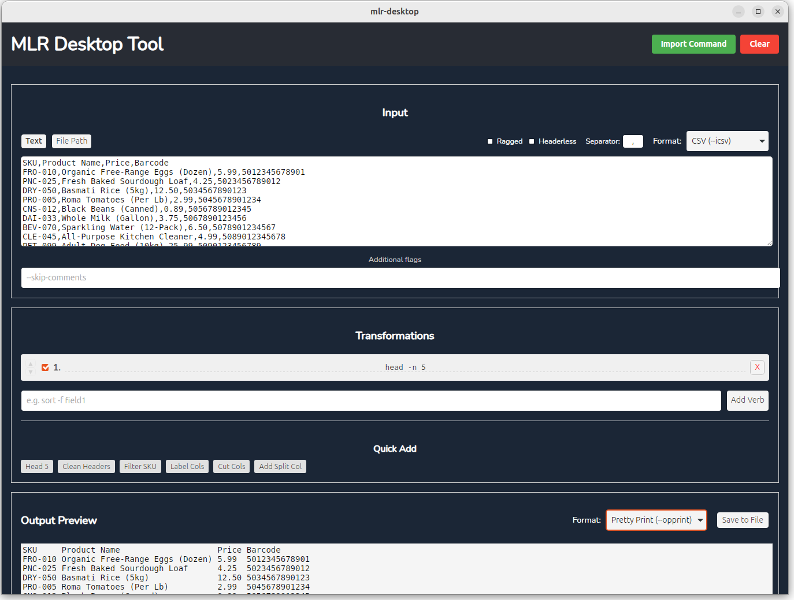

# MLR Desktop Tool

A user-friendly desktop application for transforming data using the [Miller (mlr)](https://github.com/johnkerl/miller) command-line tool. This GUI application makes it easy to experiment with mlr transformations interactively.

### Downloading Pre-built Binaries

1. Go to the [Releases](../../releases) page
2. Download the appropriate binary for your platform:
   - `mlr-desktop` - Linux x86_64 executable
   - `mlr-desktop-darwin-amd64.zip` - macOS Intel (extract and run the .app)
   - `mlr-desktop-darwin-arm64.zip` - macOS Apple Silicon (extract and run the .app)
   - `mlr-desktop-windows` - Windows x86_64 executable
3. **For macOS**: Extract the .zip file and drag the .app to your Applications folder
4. **For Linux/Windows**: Make executable (Linux: `chmod +x mlr-desktop`) and run

On Windows, you may be warned by Microsoft Defender to not run this unrecognized app. Press "More info" and then "Run anyway".


## Features



- **Interactive Preview**: See real-time output as you build your transformation pipeline
- **Sample Data**: Comes pre-loaded with sample grocery data to help you get started
- **Import command**: Import an mlr command
- **Multiple Input Formats**: Support for CSV, TSV, JSON, and NDJSON
  - CSV/TSV-specific options: Ragged, Headerless, Custom field separator
- **Multiple Output Formats**: Pretty Print, CSV, TSV, JSON, NDJSON
- **Verb Pipeline Builder**: Chain multiple mlr verbs, reorder them, enable/disable them
- **Quick Add Shortcuts**: Common transformation patterns available with one click
- **Generated command**: See the exact mlr command that will be executed
- **Save Output**: Export transformed data to a file
- **Auto-save**: Your work is automatically saved between sessions
- **File Input**: Load data from files or paste it directly


## Usage

1. **Input Data**: 
   - Use the pre-loaded sample data, or
   - Paste your own data in the text area, or
   - Click "File Path" and select a file from your system

2. **Configure Input Format**: 
   - Select the input format (CSV, TSV, JSON, NDJSON) from the dropdown
   - For CSV/TSV, enable optional flags like "Ragged" or "Headerless" if needed

3. **Add Transformations**:
   - Use the "Quick Add" shortcuts for common operations, or
   - Type custom mlr verbs in the text field (e.g., `cut -f SKU,Price`)
   - Reorder verbs by clicking the ▲/▼ buttons
   - Enable/disable verbs with checkboxes

4. **Configure Output Format**:
   - Choose your desired output format from the dropdown

5. **Preview & Save**:
   - The output updates automatically as you make changes
   - Click "Save to File" to export the transformed data
   - Copy the generated command to use mlr directly in your terminal

## Developing

Before building or running this application, you need:

1. **Go** (1.19 or later) - [Install Go](https://golang.org/doc/install)
2. **Node.js** (14 or later) - [Install Node.js](https://nodejs.org/)
3. **Wails CLI** - Install with: `go install github.com/wailsapp/wails/v2/cmd/wails@latest`
4. **Linux Development Dependencies**:
   - WebKit2GTK: `sudo apt install libwebkit2gtk-4.1-dev` (Ubuntu 22.04+) or `libwebkit2gtk-4.0-dev` (older versions)
   - Build tools: `sudo apt install build-essential`

> [!NOTE]
> The Miller data transformation library is embedded directly in the application - no external `mlr` binary installation is required!

### Development Build

To build the application for development and testing:

```bash
# For Ubuntu 22.04+ (WebKit 4.1)
wails build -tags webkit2_41

# For older Ubuntu/Debian (WebKit 4.0)
wails build -tags webkit2
```

The compiled binary will be available at `build/bin/mlr-desktop`.

### Production Build

For a production build with optimizations:

```bash
wails build -tags webkit2_41
```

## Running

After building, run the application:

```bash
./build/bin/mlr-desktop
```

## CI/CD and Downloads

This project uses GitHub Actions to automatically build executables for multiple platforms:

- **Linux** (x86_64)
- **macOS** (Intel and Apple Silicon)
- **Windows** (x86_64)

Builds are automatically triggered on:
- Push to `main` branch
- Pull requests
- Version tags (e.g., `v1.0.0`)

### Creating a Release

To create a new release with pre-built binaries:

```bash
git tag -a v0.0.1 -m "Release version 0.0.1"
git push origin v0.0.1
```

The GitHub Actions workflow will automatically build for all platforms and create a GitHub release with the binaries attached.

## License

This project is licensed under the MIT License - see the [LICENSE](LICENSE) file for details.

### Third-Party Dependencies

This project uses the following tools and frameworks:
- [Wails](https://wails.io/) - MIT License
- [Miller (mlr)](https://github.com/johnkerl/miller) - BSD 2-Clause License

Please see their respective licenses for details.

## Troubleshooting

### Application Logs

The application automatically logs all operations, errors, and crashes to help with debugging. Log files are stored in:

```
~/.mlr-desktop/logs/app.log
```

Older logs are automatically rotated and compressed:
- `app.log` - Current log file
- `app.log.1`, `app.log.2`, etc. - Previous log files
- Logs are kept for 30 days
- Maximum 5 backup files are retained
- Each file is limited to 10MB

### Common Issues

**Application crashes or shows errors:**
1. Check the log files in `~/.mlr-desktop/logs/app.log`
2. Look for ERROR or FATAL level messages
3. The stack trace will show where the crash occurred

**Frontend errors:**
- Browser console errors are automatically logged
- Check the developer console (F12) for additional details
- If you see an error boundary message, check `~/.mlr-desktop/logs/` for backend issues

**Reporting Issues:**
When reporting bugs, please include:
- The contents of `~/.mlr-desktop/logs/app.log`
- Steps to reproduce the issue
- Your operating system and version
